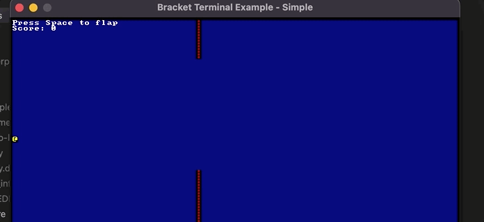

# Simple Console game: Flappy @
I started learning Rust by building simple games, begenning with this simple console game using bracket_lib library. It's was super fun: Applying the rust features such as traits, and enums...
##  Compile
### Option 1:
If you have rust installed, you just run: ```cargo run ``` in the source directory
### Option 2
Run the executable--look in targey/debug. ``` ./flappy ```
# Demo
<p align="center">
    
</p>

## EL Abassi Abderrazaq 
